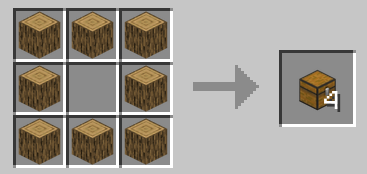
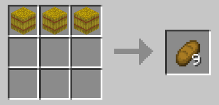

## A simple datapack for some crafting recipes

This datapack aims for a bit better crafting experience

Supported version: `Minecraft 1.21.X`

---
### How to apply the datapack
Download the pack in `Releases` tab and put it in your world's `datapacks` folder

---
### Some example recipes

More in the `example` folder