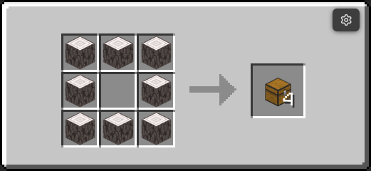
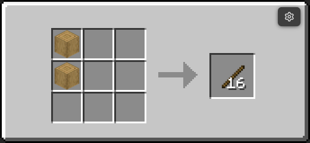
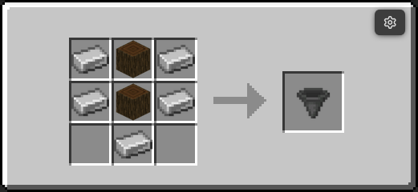

# FastCraft Datapack

## A simple datapack for some crafting recipes

Tired of the process of crafting a tons of in-the-middle recipes for items you need?

FastCraft is a datapack/mod (the *'datapack'*) you are looking for

This datapack added some fast crafting recipes for you

> Supported version: `Minecraft 1.21.X`

---

### How to apply the datapack

Download the pack in the `Releases` tab (on Github) or in the `Versions` tab (on Modrinth) and put it in your world's `datapacks` folder

> There is also a packaged mod on Modrinth. With this being a mod means that you don't need to add the datapack every time you create a new world

---

### Example Recipes

> Craft 4 chest without crafting any planks, straight from the logs

---
> You can also craft sticks from the logs, faster emerald trading

---
> This recipe appear also appear a lot in some old modpacks, I think this is one of the best thing to be able to fast craft

More in the `example` folder on Github or `Galery` tab on Modrinth

---

### For modpack devs. You can freely use this datapack for your modpack
